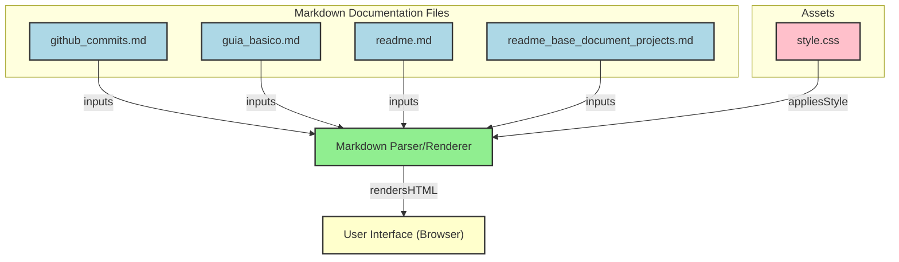

# 🌐 Nome do projeto
<div align="center">
  
</div>

<p align="center">
  <a href="https://github.com/guedes-jr/[repositories]">
    
  </a>
  <a href="https://github.com/guedes-jr/[repositories]/issues">
    
  </a>
  <a href="https://github.com/guedes-jr/[repositories]/network">
    
  </a>
  <a href="https://github.com/guedes-jr/[repositories]/stargazers">
    
  </a>
  <a href="https://github.com/guedes-jr/[repositories]/blob/main/LICENSE">
    
  </a>
</p>

## 📝 Sumário

- [🛠️ Sobre o Projeto](#sobre-o-projeto)
- [🧰 Tecnologias Utilizadas](#tecnologias-utilizadas)
- [✨ Funcionalidades](#funcionalidades)
- [📋 Requisitos](#requisitos)
- [🎨 UI e Estilização](#ui-e-estilização)
- [🚀 Instalação](#instalacao)
- [📊 Diagrama de Fluxo de Processo](#diagrama-de-fluxo-de-processo)
- [📁 Estrutura de Pastas](#estrutura-de-pastas)
- [📄 Licença](#licenca)
- [📧 Contato](#contato)

## 🛠️Sobre o Projeto

Descrição do projeto que está sendo desenvoido

## 🧰 Tecnologias Utilizadas

- [Django](https://www.djangoproject.com/) - Back-end framework
- [Next.js](https://nextjs.org/) - React framework para front-end
- [PostgreSQL](https://www.postgresql.org/) - Banco de dados
- [AntDesign](https://ant.design/) - Estilização

## ✨ Funcionalidades

- Autenticação de usuários
- CRUD de novos usuários
- Interface responsiva e moderna
- API interna para comunicação com o frontend

## 📋 Requisitos

- [Python 3](https://www.python.org/downloads/release/python-315/)
- [Node.js 14 ou superior](https://nodejs.org/pt/blog/release/v14.17.3)
- [PostgreSQL](https://www.postgresql.org/)

## 🎨 UI e Estilização

O template visual completo do sistema está disponível no [Figma](https://www.figma.com/...) – com layout responsivo, paleta de cores personalizada e tipografia consistente.

### 🔤 Fonte

* **Roboto**, sans-serif

### 🌈 Paleta de Cores

```css
--bg-color:           #F9FAFB;
--bg-modal-color:     #08070880;
--text-color:         #2C3E50;
--btn-color:          #4A90E2;
--btn-hover-color:    #336FAB;
--border-color:       #D8DDE2;

/* Status */
--danger:             #F43F5E;
--warning:            #F59E0B;
--success:            #10B981;
--info:               #3B82F6;
--white:              #ffffff;

/* Aliases */
--primary-color:         var(--primary-500);
--primary-dark-color:    var(--neutral-800);
--success-color:         var(--success);
--error-color:           var(--danger);
--info-color:            var(--info);
--warning-color:         var(--warning);
```

## 🚀 Instalação

### Clonando o Repositório

```bash
git clone https://github.com/guedes-jr/[repositories].git
```
... 

## 📦 Scripts Disponíveis

Na pasta `frontend`, você pode rodar:

- `npm run dev`: Executa a aplicação em modo de desenvolvimento.
- `npm run build`: Compila a aplicação para produção.
- `npm run start`: Inicia o servidor Next.js.

Na pasta `backend`, você pode rodar:

- `python manage.py runserver`: Inicia o servidor Django.

## 🧭 Diagrama de Fluxo de Processo
> Link para gerar mermaid https://gitdiagram.com/


## 📁 Estrutura de Pastas

```plaintext
├── backend
├── ApiRoot
│   ├── __init__.py
│   ├── asgi.py
│   ├── settings.py
│   ├── urls.py
│   └── wsgi.py
├── LICENSE
├── README.md
├── auth
│   ├── __init__.py
│   ├── admin.py
│   ├── apps.py
│   ├── models.py
│   ├── tests.py
│   └── views.py
├── frontend
│   ├── README.md
│   ├── next.config.mjs
│   ├── package-lock.json
│   ├── package.json
│   ├── postcss.config.mjs
│   ├── public
│   │   ├── banner.png
│   │   ├── next.svg
│   │   └── vercel.svg
│   ├── src
│   │   ├── app
│   │   │   ├── favicon.ico
│   │   │   ├── fetcher.ts
│   │   │   ├── globals.css
│   │   │   ├── layout.tsx
│   │   │   └── page.tsx
│   │   └── middleware.ts
│   ├── tailwind.config.ts
│   └── tsconfig.json
├── manage.py
└── requirements.txt
```
> Comando utilizado para mostrar a estrutura de dados `tree -I 'node_modules' -I '__pycache__' -I 'migrations' -I 'venv'`.

## 🤝 Contribuindo

Contribuições são bem-vindas! Sinta-se à vontade para abrir uma issue ou enviar um pull request.

1. Faça um fork do projeto
2. Crie uma nova branch (`git checkout -b feature/nova-funcionalidade`)
3. Commit suas alterações (`git commit -m 'Adiciona nova funcionalidade'`)
4. Faça o push para a branch (`git push origin feature/nova-funcionalidade`)
5. Abra um Pull Request

## 📄 Licença

Este projeto está licenciado sob a Licença MIT - veja o arquivo [LICENSE](LICENSE) para detalhes.

## 📧 Contato

👤 **Seu Nome**

- Github: [@guedes-jr](https://github.com/guedes-jr)
- LinkedIn: [João Guedes](https://www.linkedin.com/in/jo%C3%A3o-guedes-36a440135)
- Email: joao.guedes.developer@gmail.com

---

Desenvolvido com profissionalismo por [João Guedes](https://github.com/guedes-jr) 🤖.
